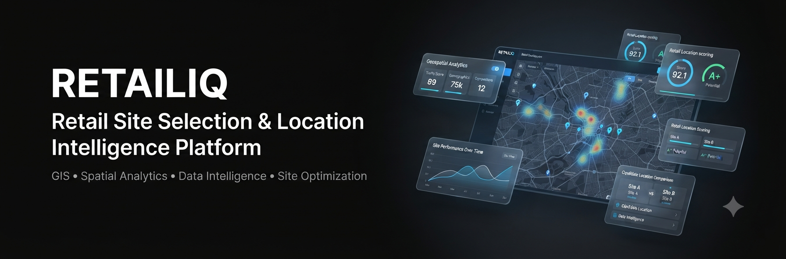
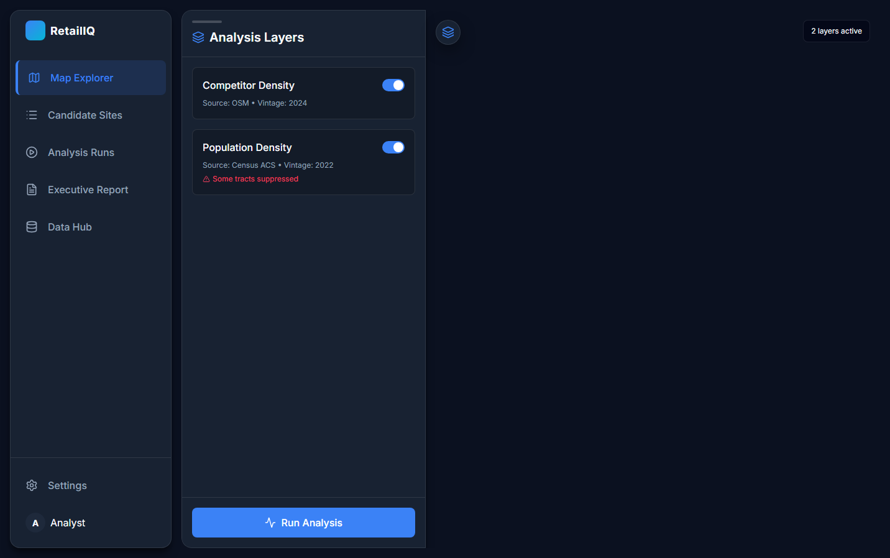
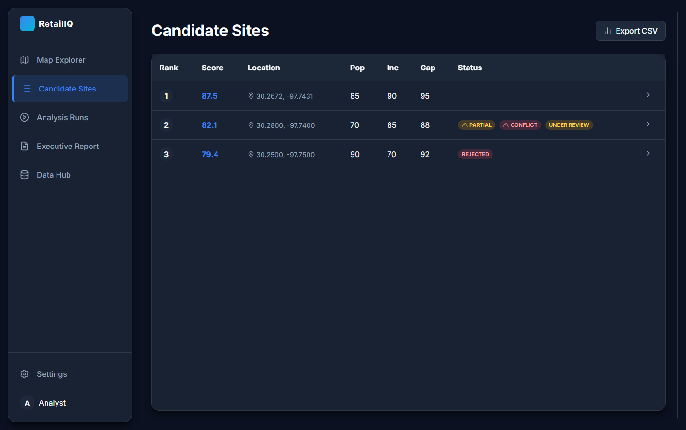
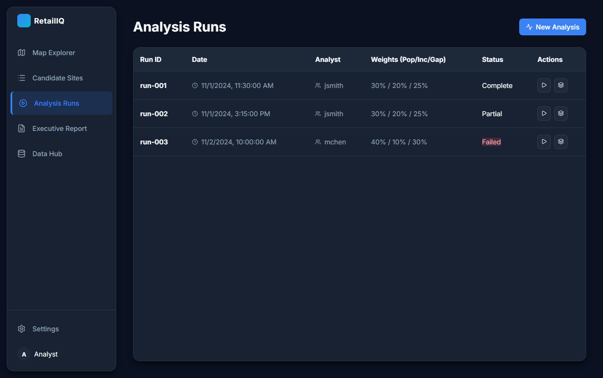
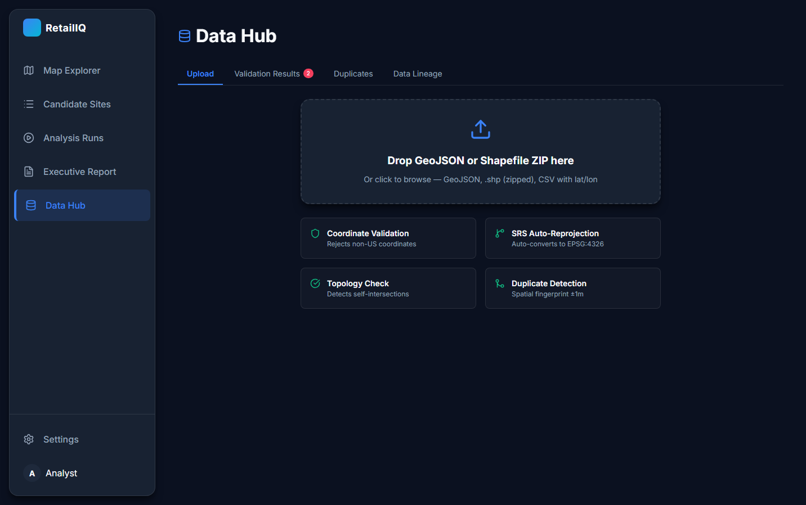

# RetailIQ



A full-stack enterprise GIS platform for retail site selection, helping businesses analyze, evaluate, and rank potential store locations using geospatial data, demographics, competitor intelligence, and spatial suitability algorithms.

RetailIQ transforms complex location data into actionable business decisions by combining interactive maps, spatial analytics, automated scoring, and data-driven recommendations.


🌐 **Live Application**

https://usretail.vercel.app/


---

# 🚀 Overview

RetailIQ is a modern retail intelligence platform designed to help analysts and businesses identify optimal locations for new retail expansion.

The platform ingests multiple data sources including:

- Demographics
- Competitor locations
- Road networks
- Public transportation data
- Geographic boundaries
- Spatial datasets

It then processes this information through weighted spatial analysis algorithms to generate location suitability scores and recommendations.


In simple terms:

> RetailIQ helps businesses answer: "Where should we open our next store, and why?"


---

# 💡 Business Capabilities

RetailIQ enables organizations to:

- Analyze potential retail locations
- Compare candidate sites
- Visualize spatial data
- Calculate location suitability scores
- Manage geospatial datasets
- Generate analytical insights
- Support data-driven expansion decisions


---

# ✨ Key Features


## 🗺 Interactive GIS Visualization

Advanced map-based analysis including:

- Interactive location maps
- Spatial data visualization
- Retail candidate locations
- Geographic overlays
- Map-based exploration


---

## 📊 Location Intelligence

The platform evaluates locations using:

- Population demographics
- Competitor proximity
- Transportation accessibility
- Geographic characteristics
- Custom weighting criteria


---

## 📍 Site Suitability Analysis

Core analytical capabilities:

- Weighted scoring algorithms
- Candidate location ranking
- Spatial suitability calculations
- Analyst adjustments
- Recommendation generation


---

## 📂 Data Management

Flexible data ingestion system supporting:

- GeoJSON files
- Shapefiles
- CSV datasets
- Coordinate-based location data

Features include:

- Dataset validation
- Duplicate detection
- Spatial data processing
- Dataset versioning


---

## 👥 User Roles & Authentication

Secure role-based platform access:

- Analyst users
- Reviewers
- Administrators

Includes:

- JWT authentication
- Permission-based workflows
- Audit tracking


---

## ⚙️ Background Processing

Built for heavy geospatial workloads:

- Async processing
- Background analysis jobs
- Queue management
- Redis-powered task processing


---

## 📈 Reporting & Analytics

Provides:

- Analysis reports
- Location insights
- Data summaries
- Decision support workflows


---

# 🏗 System Architecture

RetailIQ follows a modern full-stack architecture designed for scalable data processing.


```
RetailIQ

Frontend
│
├── React 19
├── TypeScript
├── Vite
├── React Router
├── Mapbox / MapLibre Visualization
│
Backend
│
├── FastAPI
├── Uvicorn
├── JWT Authentication
│
Data Processing
│
├── Celery Workers
├── Redis Queue
│
Database
│
├── PostgreSQL
├── PostGIS Spatial Database

```

---

# 🛠 Technology Stack


## Frontend

- React 19
- TypeScript
- Vite
- React Router
- react-map-gl
- MapLibre GL
- Lucide React
- Playwright
- Cypress


---

## Backend

- Python
- FastAPI
- Uvicorn
- JWT Authentication


---

## Geospatial & Data Processing

- PostgreSQL
- PostGIS
- GeoPandas
- Shapely
- PyProj
- Fiona


---

## Background Processing

- Celery
- Redis


---

## Infrastructure & Deployment

- Docker
- Docker Compose
- Vercel
- Render


---

# 🧠 Spatial Intelligence Workflow


```
Data Sources

     ↓

Dataset Import

     ↓

Validation & Processing

     ↓

Spatial Analysis Engine

     ↓

Suitability Scoring

     ↓

Interactive Map Visualization

     ↓

Business Decision Support

```


---

# 📸 Screenshots


## Dashboard




## Interactive Map




## Site Analysis




## Data Hub




---

# 🔐 Security Features

- JWT-based authentication
- Role-based authorization
- Protected API endpoints
- Audit logging
- Secure environment configuration


---

# 📦 Local Development


## Requirements

- Docker
- Docker Compose
- Node.js v20+
- Python 3.12+


---

## Environment Setup


Clone repository:

```bash
git clone https://github.com/ynotunited/usretail.git
```

Navigate into project:

```bash
cd usretail
```


---

## Configure Environment


Backend:

```bash
cp backend/.env.example backend/.env
```


Configure:

- Database credentials
- API keys
- Authentication settings


---

## Start Backend Infrastructure


Using Docker:

```bash
docker-compose up -d
```


Backend API:

```
http://localhost:8000
```


API Documentation:

```
http://localhost:8000/docs
```


---

## Start Frontend


Navigate:

```bash
cd frontend
```


Install dependencies:

```bash
npm install
```


Run development server:

```bash
npm run dev
```


Frontend:

```
http://localhost:5173
```


---

# 📁 Project Structure


```
usretail/

├── frontend/
│   ├── React Application
│   ├── Components
│   ├── Maps
│   └── UI Logic


├── backend/
│   ├── FastAPI Application
│   ├── APIs
│   ├── Authentication
│   └── Data Processing


├── docs/
│   ├── Architecture Documentation
│   ├── Design System
│   └── User Guides


├── Dockerfile

├── docker-compose.yml

└── render.yaml

```


---

# 🚀 Deployment

Frontend deployment:

- Vercel


Backend deployment:

- Docker containers
- Render


The project includes deployment configurations for both environments.


---

# 📌 Future Improvements

Potential enhancements:

- Machine learning based location prediction
- Automated demographic scoring
- Real-time business intelligence dashboards
- Additional geospatial datasets
- Advanced forecasting models
- Mobile companion application


---

# 👨🏽‍💻 Author


## Tony Olugbusi

Full-Stack Engineer | SaaS Builder

Building scalable software products, business platforms, AI-powered applications, and data-driven systems.


GitHub:

https://github.com/ynotunited


Portfolio:

https://tony.madeitcodes.online


---

# 📄 License

This project is developed as a software engineering portfolio project demonstrating full-stack development, geospatial systems, data processing, and modern application architecture.
